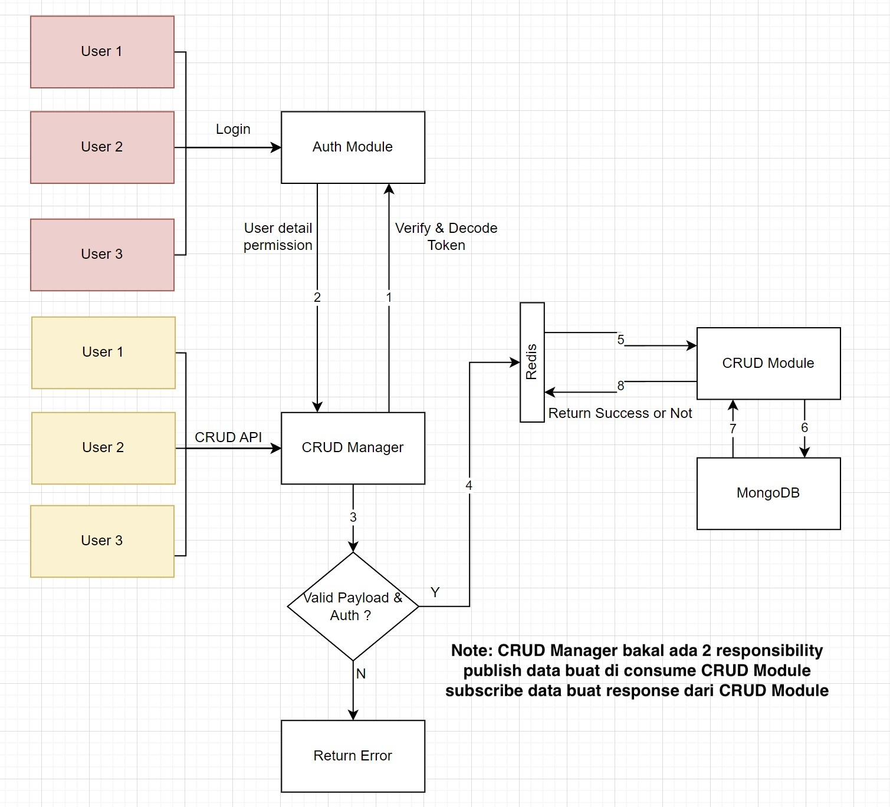

# JENIUS BE TEST
ini adalah hasil dari tugas BE TEST jenius, FYI code ini belum complete dikarenakan masalah yg belum bisa di debugging terkait subscriber redis, publisher berhasil tetapi subscriber bermasalah

aplikasi ini menggunakan `pnpm` tetapi bisa juga jika menggunakan `npm`

## Instalasi
jika ingin dijalankan di local bisa dengan command `docker-compose -f docker-compose.yaml up --build` atau bisa juga jika ingin menggunakan `npm run dev` jika tidak menggunakan `docker`

## Skema
